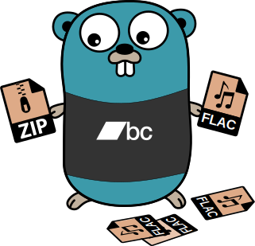

# bcmptidy - Tidy Bandcamp Files

[](https://github.com/samcunliffe/bcmptidy/actions/workflows/build-and-test.yml) [](https://codecov.io/gh/samcunliffe/bcmptidy)

This is a Go command-line utility for extracting, renaming, and organising music files purchased and downloaded from [Bandcamp](https://bandcamp.com).

<p align="center">
  
</p>

It's a little weekend project for [@samcunliffe](https://github.com/samcunliffe) to learn Go, it's very opinionated in the way the files are formatted. If you like your music files named and/or arranged in some other way it's probably not supported. (Sorry!)

I used GitHub Copilot for autocompletion and for PR review. But I do not use LLMs for generation of any substantial parts of the code. That would defeat the purpose.

## Specification

Music from Bandcamp is downloaded either as individual music files or as a zip archive of the whole album.

### Zip archive

Of the format:

```
Album Artist - Album Name.zip
```

Containing files of the format:

```
Album Artist - Album Name - 01 First Track Name.flac
Album Artist - Album Name - 02 Second Track Name.flac
...
```

### Destination

Files will be extracted and organised into a directory structure:

```
$HOME/Music/Album Artist/Album Name/01 First Track Name.flac
```

Or:

```
.
├── Album Artist
│   └── Album Name
│       ├── 01 First Track.flac
│       ├── 02 Second Track.flac
│       └── ...
└── Another Artist
```

## References

As this was a learning exercise, here are the things I used:

- [Learn Go with Tests](https://quii.gitbook.io/learn-go-with-tests)
- [Go By Example](https://gobyexample.com/)
- [Official Go Docs](https://go.dev/doc)

## Reuse

This tool is released under [MIT-0](./LICENSE.md). Hopefully the code is useful to you, and no need to attribute it to me (you can if you like).

The Gopher logo is taken from [keygx/Go-gopher-Vector](https://github.com/keygx/Go-gopher-Vector), was originally designed by Renee French and released under [CC-by 3.0](https://creativecommons.org/licenses/by/3.0/). The Bandcamp logo is adapted from [Wikimedia Commons](https://commons.wikimedia.org/wiki/File:Bandcamp-logotype-aqua.svg). The `.flac` and `.zip` icons are [CC0](https://creativecommons.org/public-domain/cc0/).
