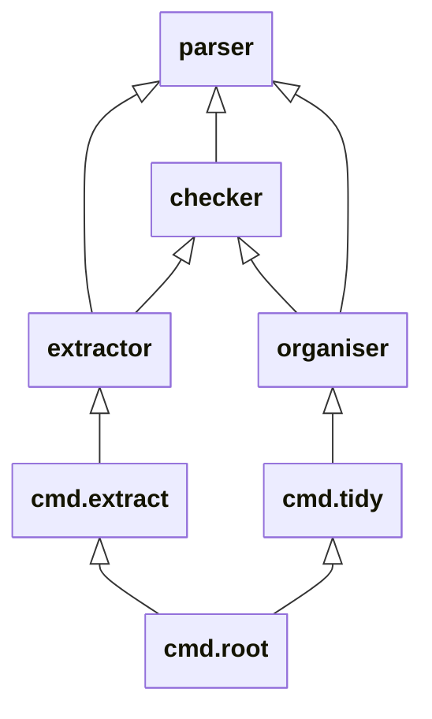

```mermaid
---
config:
    class:
         hideEmptyMembersBox: true
---
classDiagram
    parser <|-- extractor
    checker <|-- extractor
    checker <|-- organiser
    parser <|-- checker
    parser <|-- organiser
    organiser <|-- cmd.tidy
    extractor <|-- cmd.extract
    cmd.extract <|-- cmd.root
    cmd.tidy <|-- cmd.root
```
